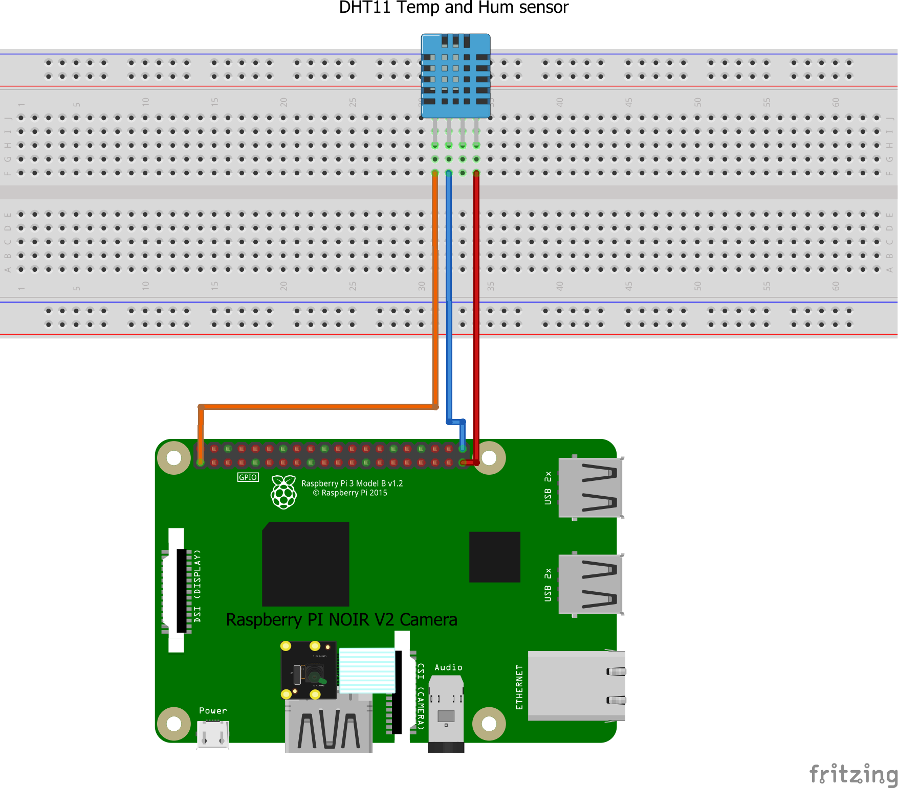
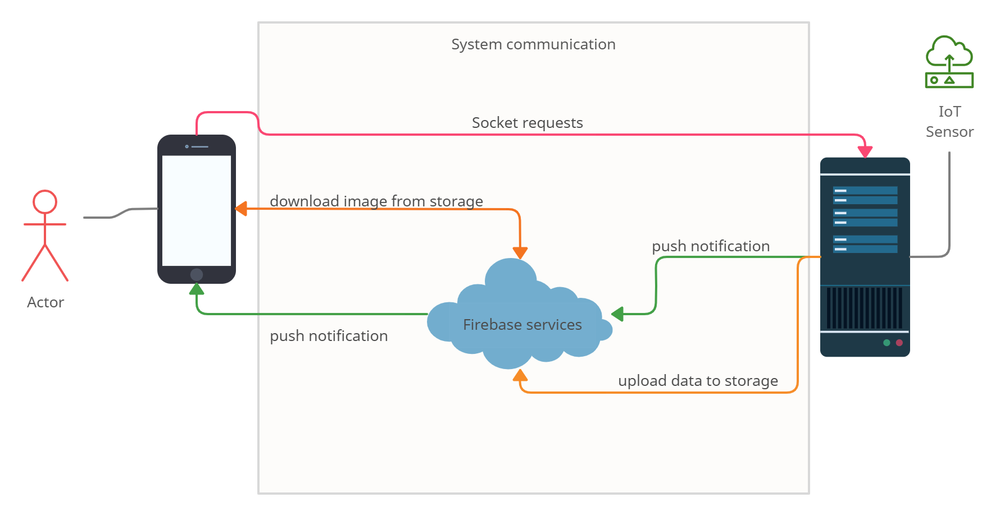

# Weather Station

The idea behind this project is to create a weather station that allows you to capture remotely(using a companion application) the temperature and humidity and get some statistics based on that. The weather station should be able to accept multiple clients and: send photos annotated with the temperature and humidity,create statistics for certain intervals(start-stop) for each of the clients individually, send the photos and statistics to the client apps.

## Screenshots
![Weather application sample demo][demo-gif]  

[(Youtube Video)][demo-yt]

## Schematics

## Requirements:

- [x] Raspberry Pi 
- [x] DH11 temperature and humidity sensor
- [x] Camera (we're using PI NOIR infrared cam)
- [x] internet connection for both, the pi and the mobile device
- [x] OS supporting Python 3 and PIP3 for Raspberry
- [x] Android OS > 4.0 for mobile device
- [x] matplotlib,numpy,pyfcm,Firebase-admin libraries for python(server)
- [x] breadboard
- [x] jumper wires

## Output
    Picture with the temperature and humidity - statistics of the temperature for an interval of time set by the client(also a picture).

## Setup and Build
0. Make sure you have the latest updates on your Debian.
1. Download related libraries on Raspberry using the following commands:
    - `pip3 install firebase-admin`
    - `pip3 install pyfcm`
    - `pip3 install matplotlib`
    - `pip3 install numpy`
2. Create a Firebase project on [Firebase Console](https://console.firebase.google.com)
    - under Project Settings -> Service Accounts -> Firebase Admin SDK -> generate a new json file containing the credentials(private key)
    - modify the name and put it inside the project folder
    - replace its name in `example.py`
3. Modify the hardcoded server IP and port from `example.py`
4. Modify the hardcoded server IP and port from `FirstFragment.kt` on the client side
5. Build and deploy the .apk on your mobile device

## Running
1. Connect the required components while having your raspberry turned off.
2. Run the program with Python3 - `python3 example.py` and wait a second for it to load
3. Open the client application on your device after installing it.
4. Press the "Get curent stats" button to receive a photo of the surroundings stamped with the temperature and humidity
5. Wait for notification to arrive, in the notification bar and then press on it or wait on the result screen until the picture arrives. Either way, the photo will be shown to you.
6. Press the "Start recording" button to set an interval start
7. Press the "Stop recording" button to set an interval stop
8. Same as before at Step 5.
10. That's pretty much it. YEY!

## Future
- [ ] Remove some blocking code on the server side. 
- [ ] Add humidity to the statistics generator.
- [ ] Implement requests using HTTP post/get for the client. (php/django over py) 
- [ ] Fix notification onResume() so that if the app is in pause state, when pressing the notification, it will bring you to the result screen. 
- [ ] Code optimization.  

[demo-gif]: demo.gif
[demo-yt]: https://www.youtube.com/watch?v=XFSqnFZqiYw
